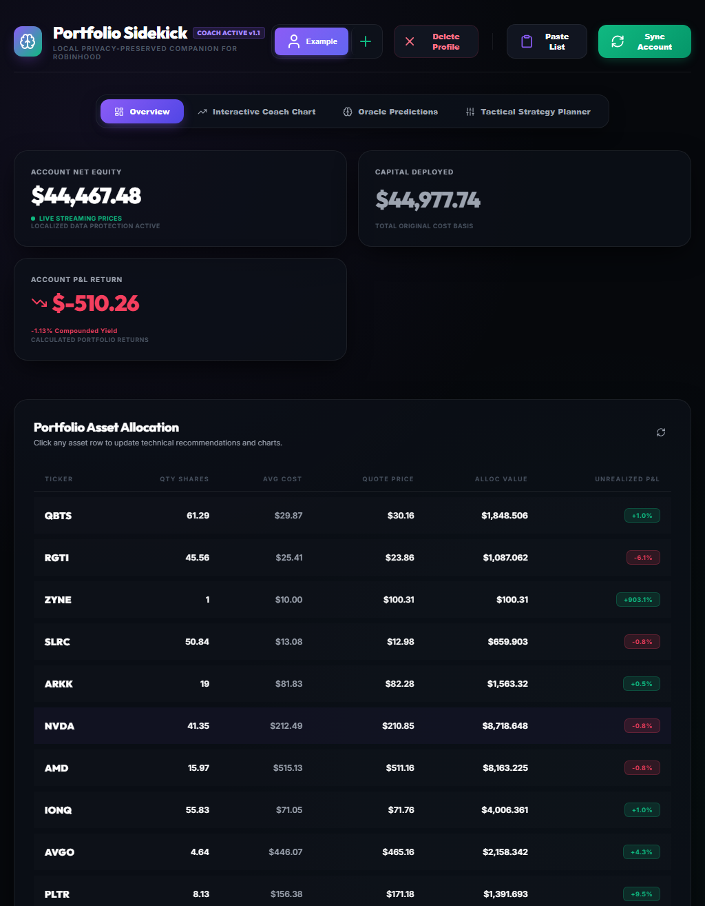
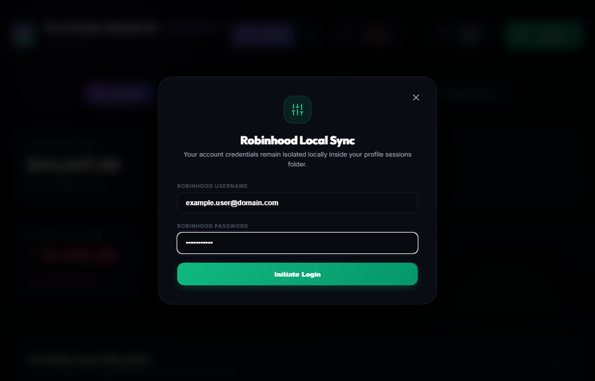
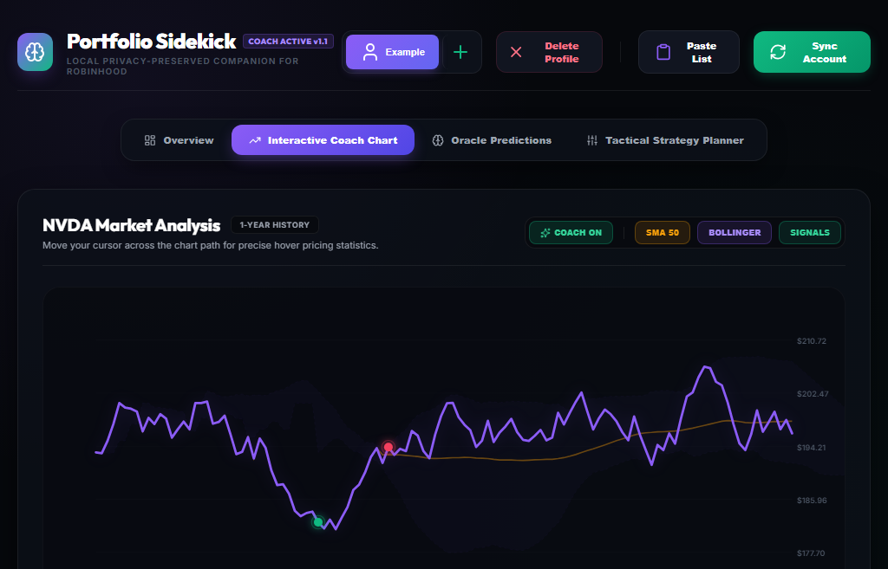
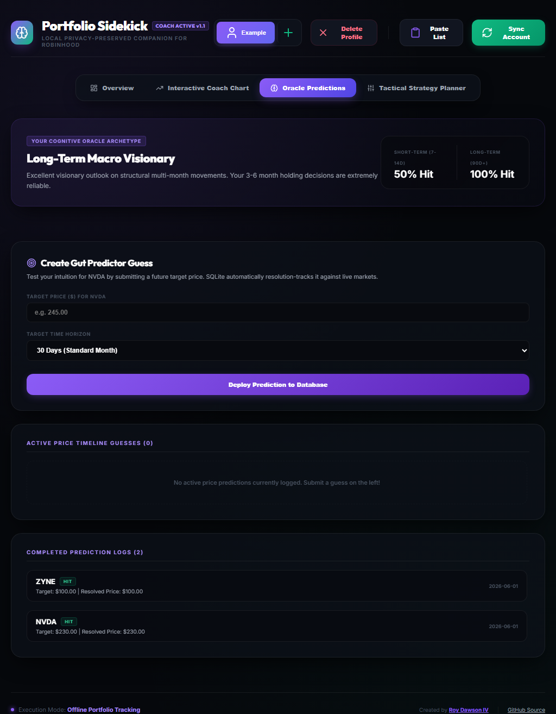
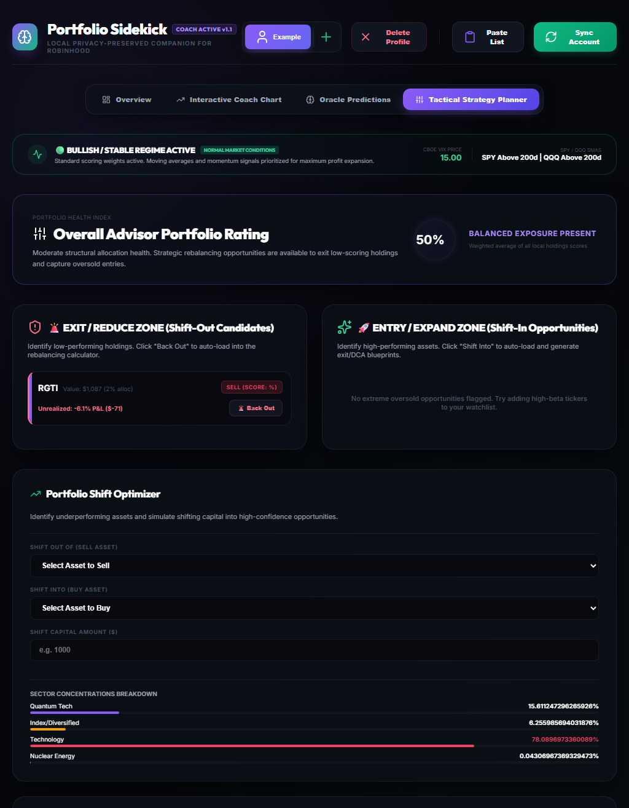

# Portfolio Sidekick (for Robinhood)

An advanced, premium, and locally-running stock analysis, prediction, and tracking tool designed specifically to help users plan, strategize, and execute trades while managing risks. It integrates secure local authentication with **Robinhood** via **embedded in-project auth** (ported from open-source `robin_stocks` semantics — no PyPI runtime dependency), while utilizing on-device **SQLite** persistence to record custom price predictions ("Gut Predictions") and automatically evolve indicator weights based on historical accuracy.

Created by: **Roy Dawson IV**  
* GitHub: [https://github.com/imyourboyroy](https://github.com/imyourboyroy)  
* PyPi: [https://pypi.org/user/ImYourBoyRoy/](https://pypi.org/user/ImYourBoyRoy/)

---

## 💻 High-Fidelity Interface

**Portfolio Sidekick** features a premium, state-of-the-art **Obsidian Glassmorphic Interface** custom designed with Google Outfit/Inter typography, harmonious purple/mint accent colors, glowing overlays, and full interactive SVG charts.

> [!TIP]
> Jump directly to the [Sample Walkthrough & Visuals](#4-sample-walkthrough--visuals) section to view high-resolution, real screenshots of all dashboard views, sync modals, and strategy planners!

---

## 🔒 Security & Privacy (Segregated Standalone Architecture)

Your peace of mind and data security are the highest priority. **Portfolio Sidekick** uses a **fully segregated, device-local architecture**:

* **Zero Cross-Device Sync:** Android and desktop are **completely independent**. Robinhood sessions, tokens, and profiles **never sync** between your phone and PC. Use either platform on its own.
* **No Companion / LAN Mode:** There is no pairing, no shared backend URL, and no `HOST=0.0.0.0` network exposure. All platforms route `/api/*` through the **embedded JS serverless layer** — no Python FastAPI or `robin_stocks` at runtime.
* **Encrypted Session Vaults:** Robinhood OAuth tokens only — passwords are **never persisted**. **Windows/macOS/Linux (Tauri):** AES-256-GCM file `robinhood_vault.enc` + local key `.vault_key` in `<exe>/data/` (or AppData when not portable). **Android (experimental):** EncryptedSharedPreferences via the Capacitor vault plugin.
* **Sync is 100% Optional:** Sandbox mode, paste import, and manual holdings work without any Robinhood connection.
* **True Local Isolation (Zero Cloud):** No cloud databases, telemetry, or third-party relay servers.

---

## 1. Use Case Synopsis

**Portfolio Sidekick** delivers a high-aesthetic, production-grade local suite to track and analyze equity holdings securely:
* **Multi-User Profiles**: Seamless profile-switching supporting independent portfolios and prediction track-records.
* **Two-Phase Non-Blocking Auth**: Secure integration with Robinhood supporting SMS, Email, and App Push multi-factor authentication (MFA) challenges.
* **Advanced Scoring Scanners**: Pure JavaScript calculation engine for Wilder Relative Strength Index (RSI), MACD Histogram, Bollinger Bands, and dynamic EMA/SMA crossovers.
* **Watchlist & Entry Triggers**: High-fidelity watchlist supporting live quote checks and technical entry scanning (e.g. *Oversold Pullback*, *Bollinger Support Bounce*, *Bullish Momentum Shift*).
* **Tactical Rebalancer**: Real-time allocation simulator previews share trades and cash shifts before making live movements.
* **Bracket Strategy Blueprints**: Dynamic trade templates automatically calculating multi-stage Scale-Out profit takes and Scale-In DCA support entries.
* **Self-Evolving Local Weights**: Resolves custom price predictions over time, backtesting indicators across multiple historical epochs (Swing, Cycle, and Peak-to-Trough Stress) to calibrate the local recommender automatically.

---

## 2. Platform Portability & Releases

The toolkit is designed to be fully portable and compiled into standalone executable environments across major architectures (supporting both **x64** and **ARM64** platforms natively):

| Platform | Output Artifact | Format / Delivery | Architecture Support |
| :--- | :--- | :--- | :--- |
| **Windows** | `PortfolioSidekick-Windows.exe` | Tauri 2 native executable (NSIS installer or portable EXE) | x64 |
| **macOS** | `PortfolioSidekick-MacOS.zip` | Tauri `.app` bundle | ARM64 / Universal |
| **Linux (Ubuntu)** | `PortfolioSidekick-Linux.tar.gz` | Tauri AppImage or binary tarball | x64 |
| **Android** *(experimental)* | `PortfolioSidekick-Android.apk` | Capacitor APK (launcher label: **Sidekick**) — JS auth path; not validated on physical devices in v1.7.7 | ARM64 |

### Automated Compilations on GitHub
Every release tag (`v*`) triggers CI: **Tauri** desktop builds (Windows/macOS/Linux) + **Capacitor** Android APK. No Python or PyInstaller.

### Security model (v1.7.7+)
| Asset | Storage | Notes |
|-------|---------|-------|
| Portfolio data | SQLite (`portfolio_sidekick.db`) | Tauri portable `<exe>/data/`, AppData, or IndexedDB (browser dev) |
| Robinhood OAuth tokens | Per-platform vault | **Never** in SQLite. Desktop: Rust `vault_read`/`vault_write` → AES-256-GCM `robinhood_vault.enc`. Android: EncryptedSharedPreferences (experimental) |
| Auth diagnostics | `auth.log` | Desktop portable data dir — login, refresh, sync steps |
| Network | Allowlist | `api.robinhood.com`, Yahoo Finance only (CSP + Android network security config) |
| Backups | Disabled | `allowBackup=false` on Android; no cloud sync |

> **Desktop is the supported path.** Run `frontend\src-tauri\target\release\portfolio-sidekick.exe` (or `PortfolioSidekick-Windows.exe` from releases). Browser `npm run dev` does not support Robinhood login. 

---

## 3. Integration Guide

### Standalone Integration (Local Execution)

If you prefer running the development server locally:

#### Prerequisites
* **Node.js**: 24+ (LTS recommended)
* **Rust**: 1.88+ ([rustup.rs](https://rustup.rs)) — required for Tauri desktop builds
* **Python**: 3.12+ — **optional**, legacy `backend/` reference and `verify_toolkit.py` only (not used at runtime in v1.7.7)

#### Installation & Execution
1. **Clone and Enter Workspace**:
   ```bash
   git clone https://github.com/ImYourBoyRoy/PortfolioSidekick.git
   cd PortfolioSidekick
   ```
2. **Boot React Frontend (primary dev path — no Python server required)**:
   ```bash
   cd frontend
   npm install
   npm run dev
   ```
   *Loads at `http://localhost:5173`. All `/api/*` routes are handled in-process by `frontend/src/serverless/apiRouter.js`.*
3. **Tauri desktop (Windows / macOS / Linux)**:
   ```bash
   cd frontend
   npm install
   npm run tauri:build
   ```
   *Requires [Rust](https://rustup.rs) 1.88+. Windows: `.\compile_windows.ps1`*
4. **Android standalone build**:
   ```bash
   cd frontend
   npm run build
   npx cap add android   # first time only
   npx cap sync android
   node scripts/patch-android-build.mjs
   ```
   ***Experimental:** Robinhood auth uses embedded JS + CapacitorHttp; Kotlin plugin stores encrypted sessions. Prefer desktop Tauri for production Robinhood sync until Android is validated on a physical device.*

   **Sideload upgrades (install over existing APK):** Android only allows in-place upgrades when the new APK is signed with the **same key** and has a **higher `versionCode`**. CI patches `versionCode` from `APP_VERSION` (e.g. `1.7.13` → `10713`) and uses either:
   - **Release keystore** (recommended): add GitHub Actions secrets `ANDROID_KEYSTORE_BASE64`, `ANDROID_KEYSTORE_PASSWORD`, `ANDROID_KEY_ALIAS`, `ANDROID_KEY_PASSWORD`. Generate once with `frontend/scripts/generate-android-keystore.sh` (requires JDK `keytool`).
   - **Cached debug keystore** (fallback): if no release secrets are set, CI caches `~/.android/debug.keystore` so debug APKs keep a stable signature across builds.

   If you installed an older GitHub APK (v1.7.12 or earlier), you may need to **uninstall once** because those builds used ephemeral debug keys. After that, v1.7.13+ APKs from the same signing path should upgrade in place.

---

### Agentic & MCP Server Integration

**Portfolio Sidekick** is designed with autonomous software agents in mind, offering low hidden state, strict typing, and high testability.

#### 1. Calling the Verification Engine Natively
Agents can programmatically execute the integrity check suite to assert correct local SQLite database behavior and quantitative scanner outputs:
```bash
python backend/verify_toolkit.py
```

#### 2. Querying Backend Endpoints via MCP HTTP Gateway (Dev Mode Only)
In development, MCP clients can query the loopback API with a session header:
```bash
TOKEN=$(curl -s http://127.0.0.1:8000/api/dev/session | python3 -c "import sys,json; print(json.load(sys.stdin)['token'])")
curl -H "X-Sidekick-Local-Session: $TOKEN" http://127.0.0.1:8000/api/profiles
```
Production desktop builds do not expose HTTP.

---

## 4. Sample Walkthrough & Visuals

**Portfolio Sidekick** runs as a **standalone app per platform**: desktop via **Tauri 2 + Rust** (native Robinhood HTTP + encrypted vault), Android via Capacitor *(experimental)*. Portfolio data is stored locally (SQLite). Robinhood OAuth tokens never leave the device they were created on; Android and desktop vaults do **not** sync with each other.

Below is an authentic visual walkthrough of the real, running application:

### 📊 1. Multi-Profile Dashboard Overview
Exposes beautiful, real-time capital deployed summary cards, unrealized P&L gauges, asset allocation weights, and a unified scoring dial. Bootstraps a single, highly detailed active profile named **"Example"** pre-populated with realistic quantum and technology holdings (e.g. QBTS, RGTI, NVDA, AMD) to showcase the interface instantly:



---

### 🔒 2. Two-Phase Non-Blocking Local Sync
Allows secure, direct Robinhood connection synchronizing holdings natively. Your credentials remain isolated locally under your profile sessions. Username fields are fully anonymized (`example.user@domain.com`) and passwords are masked with standard anonymous placeholder dots:



---

### 📈 3. Interactive Technical Coach Chart
Exposes custom financial charting rendered natively using responsive SVG shapes, featuring **interactive cursor crosshair guidelines**, **floating glassmorphism OHLC hover tooltips**, cost-basis lines ($212.49), SMA 50, Bollinger Bands, and glowing action markers on the price path:



---

### 🔮 4. Oracle Predictor & Cognitive Archetype
Allows you to submit Price Target predictions (e.g. "$X in Y days") to evaluate your market intuition. As SQLite/localStorage tracks your precision, the system processes your cognitive traits and issues a detailed **Cognitive Oracle Archetype Certificate** analyzing short-term and long-term percentage hit rates:



---

### 🛡️ 5. Tactical Strategy & Bracket Planner
Exposes real-time rebalancing simulator calculators, single-sector concentration warning gauges (capping allocations at 25%), scale-out profit take brackets, and a dynamic **VIX-smoothed Market Regime Filter** that automatically tightens buy scoring rules under bearish cycles:



---

## 5. Acknowledgements & Credits

We stand on the shoulders of giants. This toolkit would not be possible without the incredible work of the open-source community:

* **Robinhood HTTP semantics**: Auth primitives ported from the open-source [robin-stocks](https://github.com/jmfernandes/robin_stocks) project (MIT) — embedded in-project, no PyPI runtime dependency.
* **Desktop shell**: [Tauri 2](https://tauri.app) (Rust) for secure, cross-platform native desktop builds.
* **Mobile shell**: [Capacitor](https://capacitorjs.com) with Kotlin encrypted session vault on Android.
* **React / Vite / Lucide**: Kudos to the core developers of [React](https://react.dev), [Vite](https://vite.dev), and [Lucide Icons](https://lucide.dev) for providing high-fidelity visual and micro-animation foundations that make this application premium and glassmorphic.

---

## 6. Project Directory Map

```text
StockToolkit/
├── .github/
│   └── workflows/
│       └── build.yml         # Matrix Release compilations (Win/Mac/Linux/Android)
├── assets/
│   ├── logo.png              # High-fidelity geometric Obsidian branding
│   ├── icon.ico              # Multi-resolution Windows app executable icon
│   ├── icon.icns             # Multi-resolution macOS app bundle icon
│   ├── icon.png              # High-resolution PNG logo wrapper
│   └── android/              # Responsive Android density launcher launcher icons
├── backend/                  # DEPRECATED legacy Python (reference only — see DEPRECATED.md)
├── frontend/
│   ├── src-tauri/            # Tauri 2 Rust desktop shell (Windows/macOS/Linux)
│   ├── capacitor.config.json # Mobile application mapping parameters
│   ├── package.json          # UI Node package parameters
│   └── src/
│       ├── App.jsx           # Main React UI Dashboard & SVG Charts
│       ├── main.jsx          # DB bootstrap + Vite mount
│       ├── sidekickClient.js # Unified serverless API transport
│       ├── plugins/robinhood-session/  # Encrypted OAuth vault plugin
│       └── serverless/       # SQLite, apiRouter, robinhoodAuth, advisor, news
│   └── native/android/       # Kotlin session vault (injected at CI build)
├── compile_windows.ps1       # Tauri Windows desktop compiler
└── PortfolioSidekick.spec    # DEPRECATED PyInstaller spec (pre-v1.7)
```
